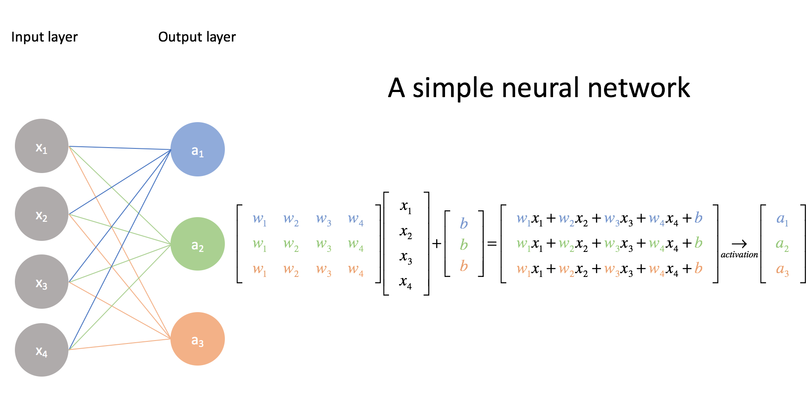
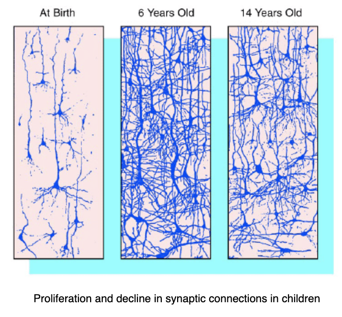
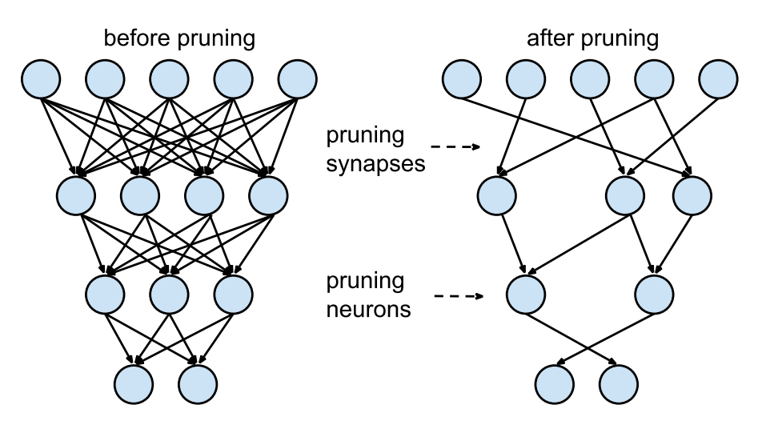
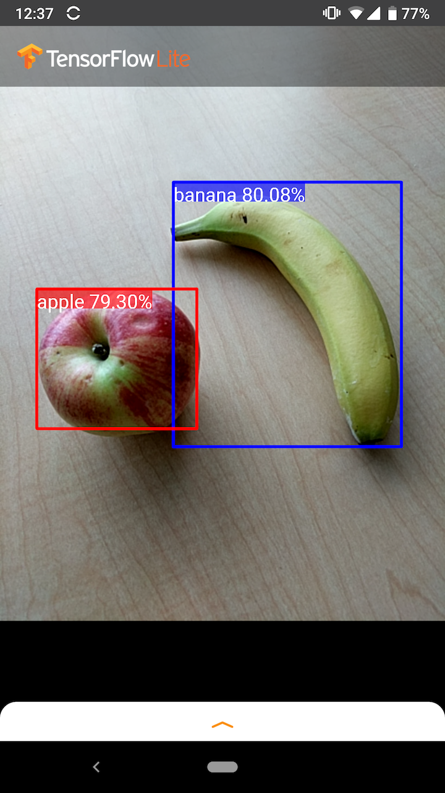

## Spaß mit Neuronalen Netzen
<!-- .slide: data-background-image="media/bg.jpg" -->
###### OngoingMedia GmbH - ©Tobias Wessels - 06/2021

---
## Neuronale Netze
 - Erstmals beschrieben 1943 von Warren McCulloch und Walter Pitts 
 - Neue Erfolge in Mustererkennungswettbewerben seit 2009
 - Seitdem im Höhenflug!

--
Turing Award 2018 für die "[Godfathers of AI](https://awards.acm.org/about/2018-turing)"

--
 <!-- .element width="100%" -->

--
 <!-- .element width="70%" -->

--
 <!-- .element width="100%" -->

--
 <!-- .element height="100%" width="100%" -->
[Source](https://towardsdatascience.com/the-mostly-complete-chart-of-neural-networks-explained-3fb6f2367464)

---
## Anwendungen
 - [Image Generation](https://thispersondoesnotexist.com)
 - [Text Generation](http://shortlyai.com)
 - [Video Upscaling and Colorization](https://www.youtube.com/watch?time_continue=140&v=hZ1OgQL9_Cw&feature=emb_logo)
 - [Art](https://www.youtube.com/watch?v=6avJHaC3C2U&t=2317s)
 - Vieles mehr: Spamfilter, Börsenkurse, Deepfakes, Tumor-Erkennung, Lösung des Travelling Salesmen Problems, Taxonomie

--
 <!-- .element height="100%" width="100%" -->

--
## Motivation
 - Überlasse das Trainieren den Profis - nutze die [trainierten Netze!](https://tfhub.dev)
 - Zur [Inferenz](https://www.tensorflow.org/lite/guide/inference) nutze TensorFlow Lite 

---
## TensorFlow Lite
 - Kann keine Netze trainieren, dafür aber **ausführen**
 - Läuft insbesondere auch  auf **eingebetteten Systemen** (Smartphones, RaspberryPi) 🤳
 - Quantisierte Netze (8-bit statt 64-bit weights)
   - kompaktere Model-Files (mobilenet: 13MB)

--
## Pruning

--

--
- Nur durch das Pruning können wir überhaupt Autofahren und andere komplizierte Dinge tun 💁‍♂️

--
## Showtime
 <!-- .element height="50%" width="50%" -->

---
## Fragen???
