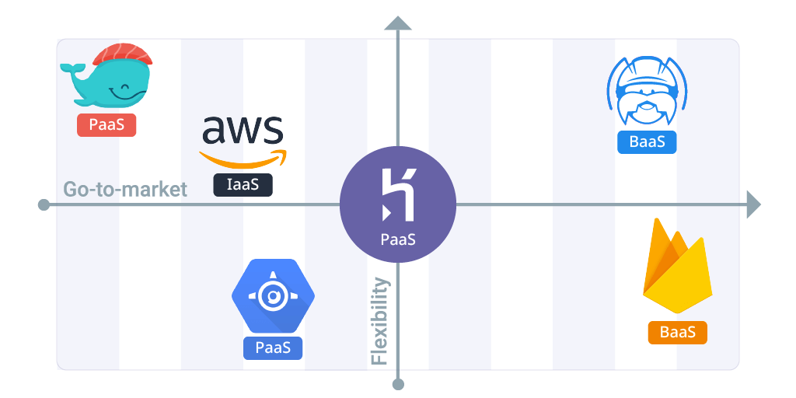
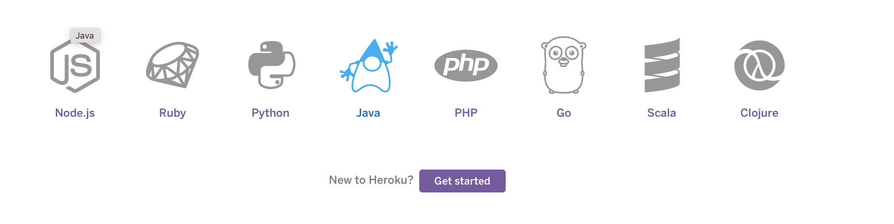
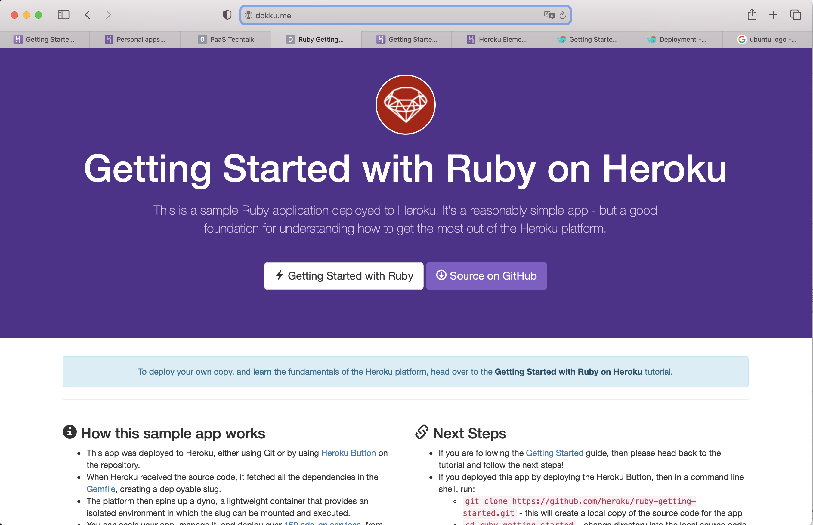

## Platform as a Service (PaaS)
<!-- .slide: data-background-image="img/platforms.jpg" -->
###### OngoingMedia GmbH - ©Tobias Wessels - 04/2021

---
## Definition
<!-- .slide: data-background-image="img/clouds.jpg" -->
"Als PaaS bezeichnet man eine Dienstleistung, die in der Cloud eine <ins>Computer-Plattform zur Entwicklung von Webanwendungen</ins> zur Verfügung stellt. Sie unterstützen den gesamten Software-Lebenszyklus vom Design über die Entwicklung, den Test, die Auslieferung bis hin zum Betrieb der Webanwendungen über das Internet. PaaS ist ein Teil von 
[Everything as a Service](https://de.wikipedia.org/wiki/Everything_as_a_Service)."

--
## Übersicht
 <!-- .element height="100%" width="100%" -->

--
## Gründe
 <!-- .element height="100%" width="100%" -->

---
 <!-- .element height="50%" width="50%" -->
--
## Heroku
   > Heroku is a PaaS (Platform as a Service) and one of the pioneers of cloud services.
 - gegründet: 2007
 - *app-centric approach*
 - verwaltetes Containersystem als Workhorse
 - gute Entwicklertools und Workflows
--
## Workflow
--
### Commandline-Tools installieren
    $ brew install heroku/brew/heroku
 ..

    $ heroku login
    heroku: Press any key to open up the browser to login or q to exit
    ›   Warning: If browser does not open, visit
    ›   https://cli-auth.heroku.com/auth/browser/***
    heroku: Waiting for login...
    Logging in... done
    Logged in as me@example.com
--
### Klone ein Getting-Started Repository

```bash
$ git clone https://github.com/heroku/java-getting-started
$ cd java-getting-started
```
--
### Erstelle und Deploye eine App
```bash
$ heroku create
Creating app... done, stark-earth-43785
https://stark-earth-43785.herokuapp.com/ | https://git.heroku.com/stark-earth-43785.git
```
 ..
```bash
$ git push heroku main

remote: Compressing source files... done.
remote: Building source:
remote:
remote: -----> Java app detected
remote: -----> Installing JDK 1.8... done
remote: -----> Executing Maven
...
remote:        [INFO] ------------------------------------------------------------------------
remote:        [INFO] BUILD SUCCESS
remote:        [INFO] ------------------------------------------------------------------------
remote:        [INFO] Total time:  16.233 s
remote:        [INFO] Finished at: 2020-09-03T19:53:21Z
remote:        [INFO] ------------------------------------------------------------------------
remote: -----> Discovering process types
remote:        Procfile declares types -> web
remote:
remote: -----> Compressing...
remote:        Done: 71.4M
remote: -----> Launching...
remote:        Released v5
remote:        https://stark-earth-43785.herokuapp.com/ deployed to Heroku
remote:
remote: Verifying deploy... done.
To https://git.heroku.com/stark-earth-43785.git
 * [new branch]      main -> main
```
--
### Skaliere die App
- Auflisten aller Prozesse
```bash
$ heroku ps
Free dyno hours quota remaining this month: 999h 46m (99%)
Free dyno usage for this app: 0h 0m (0%)
For more information on dyno sleeping and how to upgrade, see:
https://devcenter.heroku.com/articles/dyno-sleeping
=== web (Free): java -jar target/java-getting-started-1.0.jar (1)
web.1: up 2020/09/03 14:53:42 -0500 (~ 11s ago)
```

- Anzahl der Instanzen erhöhen
```bash
heroku ps:scale web=2
```


--
### Deploy changes
- Füge beliebige Abhängigkeiten in `pom.xml` hinzu:
```xml
<dependency>
  <groupId>org.jscience</groupId>
  <artifactId>jscience</artifactId>
  <version>4.3.1</version>
</dependency>
```
- Editiere / re-strukturiere den Quellcode
```java
@RequestMapping("/hello")
String hello(Map<String, Object> model) {
    RelativisticModel.select();
    Amount<Mass> m = Amount.valueOf("12 GeV").to(KILOGRAM);
    model.put("science", "E=mc^2: 12 GeV = " + m.toString());
    return "hello";
}
```
--
### Deploy changes
```bash
mvn clean install
...
[INFO] Installing /Users/rschneeman/Documents/projects/tmp/java-getting-started/docs/tmp/java-getting-started/pom.xml to /Users/rschneeman/.m2/repository/com/example/java-getting-started/1.0/java-getting-started-1.0.pom
[INFO] ------------------------------------------------------------------------
[INFO] BUILD SUCCESS
[INFO] ------------------------------------------------------------------------
[INFO] Total time:  4.599 s
[INFO] Finished at: 2020-09-03T14:55:07-05:00
[INFO] ------------------------------------------------------------------------
````

- Lokal testen
```bash
$ heroku local web
...
2:55:13 PM web.1 |  2020-09-03 14:55:13.555  INFO 24685 --- [           main] o.s.s.concurrent.ThreadPoolTaskExecutor  : Initializing ExecutorService 'applicationTaskExecutor'
2:55:13 PM web.1 |  2020-09-03 14:55:13.683  INFO 24685 --- [           main] o.s.b.a.w.s.WelcomePageHandlerMapping    : Adding welcome page template: index
2:55:14 PM web.1 |  2020-09-03 14:55:14.252  INFO 24685 --- [           main] o.s.b.a.e.web.EndpointLinksResolver      : Exposing 2 endpoint(s) beneath base path '/actuator'
2:55:14 PM web.1 |  2020-09-03 14:55:14.318  INFO 24685 --- [           main] o.s.b
```
--
### Deploy changes
- Änderungen einchecken
```bash
$ git add .
$ git commit -m "Demo"
````

- Deployment Pipeline triggern
```bash
$ git push heroku main
````

- App im Browser anzeigen
```bash
$ heroku open hello
```
--
## Kommando(s) auf dem Server ausführen
```bash
$ heroku run java -version
Running java -version on stark-earth-43785... connecting, run.7199 (Free)Running java -version on stark-earth-43785... up, run.7199 (Free)
openjdk version "1.8.0_262-heroku"
OpenJDK Runtime Environment (build 1.8.0_262-heroku-b10)
OpenJDK 64-Bit Server VM (build 25.262-b10, mixed mode)
```
--
## Anzeige von Logs
```bash
$ heroku logs --tail
2020-09-03T19:53:41.834061+00:00 app[web.1]: 2020-09-03 19:53:41.833  INFO 4 --- [           main] o.s.b.w.embedded.tomcat.TomcatWebServer  : Tomcat started on port(s): 9160 (http) with context path ''
2020-09-03T19:53:41.859513+00:00 app[web.1]: 2020-09-03 19:53:41.859  INFO 4 --- [           main] com.example.Main                         : Started Main in 5.223 seconds (JVM running for 6.015)
2020-09-03T19:53:42.284354+00:00 heroku[web.1]: State changed from starting to up
2020-09-03T19:53:45.480254+00:00 app[web.1]: 2020-09-03 19:53:45.479  INFO 4 --- [nio-9160-exec-3] o.a.c.c.C.[Tomcat].[localhost].[/]       : Initializing Spring DispatcherServlet 'dispatcherServlet'
2020-09-03T19:53:45.480412+00:00 app[web.1]: 2020-09-03 19:53:45.480  INFO 4 --- [nio-9160-exec-3] o.s.web.servlet.DispatcherServlet        : Initializing Servlet 'dispatcherServlet'
2020-09-03T19:53:45.490317+00:00 app[web.1]: 2020-09-03 19:53:45.490  INFO 4 --- [nio-9160-exec-3] o.s.web.servlet.DispatcherServlet        : Completed initialization in 10 ms
2020-09-03T19:53:46.177377+00:00 heroku[router]: at=info method=GET path="/" host=stark-earth-43785.herokuapp.com request_id=16e66b60-d846-404a-a8b8-c46689071573 fwd="13.110.54.39" dyno=web.1 connect=0ms service=734ms status=200 bytes=7330 protocol=https
2020-09-03T19:53:46.374506+00:00 heroku[router]: at=info method=GET path="/stylesheets/main.css" host=stark-earth-43785.herokuapp.com request_id=aadacd54-0b4b-442e-8857-1382390cb443 fwd="13.110.54.39" dyno=web.1 connect=0ms service=22ms status=200 bytes=896 protocol=https
2020-09-03T19:53:46.472719+00:00 heroku[router]: at=info method=GET path="/lang-logo.png" host=stark-earth-43785.herokuapp.com request_id=a362c2c2-6bf5-49ba-9d48-a49c8f100b8d fwd="13.110.54.39" dyno=web.1 connect=0ms service=6ms status=200 bytes=4433 protocol=https
2020-09-03T19:53:46.551719+00:00 heroku[router]: at=info method=GET path="/webjars/jquery/3.3.1-1/jquery.min.js" host=stark-earth-43785.herokuapp.com request_id=99a7f95a-5067-4315-842f-5b4116d715ba fwd="13.110.54.39" dyno=web.1 connect=1ms service=8ms status=200 bytes=87218 protocol=https
```
--
## Fazit
  * Läuft auf AWS → Kosten können hoch werden! 💰
  * Im Free-Tier werden Dynos nach 30 min gestoppt 😴
  * Wird ergänzt durch [150+ Plugins](https://elements.heroku.com) 💊
  * Vendor lock-in
--
## Heroku Alternativen
  - Back4app
  - Elastic Beanstalk (AWS)
  - Google App Engine
  - **Dokku**
  - Firebase
  - OpenShift
  - Engine Yard
  - Netlify
  - Docker
  - Kubernetes

--- 
 <!-- .element height="50%" width="50%" -->
 - Mini-Heroku Klon (erster Commit enthielt 100 Zeilen Bash Code)
 - kleinste existierende PaaS Implementierung
 - Betrieb im eigenen Rechenzentrum (**on-premise**)
 - einfache Installation
--
## Installation
- Ubuntu 16.04/18.04/20.04, Debian 9 oder CentOS 7
- Min. 1GB freien Speicher

<!-- .element height="20%" width="20%" -->
--
## Installation
```bash
# for debian systems, installs Dokku via apt-get
$ wget https://raw.githubusercontent.com/dokku/dokku/v0.24.7/bootstrap.sh;
$ sudo DOKKU_TAG=v0.24.7 bash bootstrap.sh
```
--
## App erstellen und deployen
- Klone eine Heroku Repository ☝️
```bash
$ git clone https://github.com/heroku/ruby-getting-started
```
- Erstelle eine neue App
```bash
# on the Dokku host
$ dokku apps:create ruby-getting-started
```
- Füge einen Datenspeicher bereit 🆕
```bash
$ sudo dokku plugin:install https://github.com/dokku/dokku-postgres.git
```
--
## App erstellen und deployen
- Erstelle einen Postgres Service 🆕
```bash
$ dokku postgres:create railsdatabase
```
- ..und verbinde diesen mit dem Backend 🆕
```bash
$ dokku postgres:link railsdatabase ruby-getting-started
```
- Stoße Build- und Deployment-Pipeline an:
```bash
$ cd ruby-getting-started
$ git remote add dokku dokku@dokku.me:ruby-getting-started
$ git push dokku main:master
```
--


---
## Wie findet Ihr PaaS??